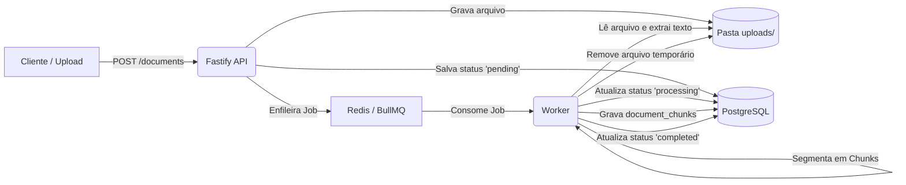

# DocOps Agent

Assistente de documentação com RAG e ações seguras. Este projeto será desenvolvido em fases, com foco em uma arquitetura de aplicação de IA preparada para produção.

## Progresso

- [x] **Fase 1 — Configuração do ambiente local**
- [x] **Fase 2 — Autenticação, RBAC e estrutura base da API**
- [x] **Fase 3 — Upload e processamento assíncrono de documentos**
- [ ] Fase 4 — RAG com PostgreSQL e pgvector
- [ ] Fase 5 — Chat com streaming
- [ ] Fase 6 — Tool calling, validação e aprovação de ações
- [ ] Fase 7 — Observabilidade
- [ ] Fase 8 — Segurança avançada e testes

---

# Fase 1 — Configuração do ambiente

## Objetivo

Preparar a infraestrutura local necessária para o desenvolvimento do DocOps Agent:

- **PostgreSQL 16** com a extensão **pgvector**
- **Redis 7**, que será usado posteriormente pelas filas
- **Jaeger**, para visualizar traces quando a aplicação estiver instrumentada
- Estrutura inicial de monorepo com npm workspaces
- Configuração centralizada de variáveis de ambiente com Zod

## Pré-requisitos

Instale e verifique:

- [Node.js](https://nodejs.org/)
- npm, incluído com Node.js
- [Docker Desktop](https://www.docker.com/products/docker-desktop/)
- Git

Comandos para conferir as versões:

```powershell
node --version
npm --version
docker --version
docker compose version
```

## Estrutura inicial

A estrutura criada na Fase 1:

```text
docops-agent/
├── apps/
│   ├── api/
│   └── worker/
├── packages/
│   ├── ai/
│   ├── config/
│   ├── database/
│   ├── observability/
│   ├── rag/
│   ├── security/
│   └── tools/
├── migrations/
├── .env
├── .env.example
├── .gitignore
├── docker-compose.yml
├── package.json
├── package-lock.json
└── tsconfig.json
```

> Os diretórios das próximas fases podem estar vazios neste momento. Eles serão preenchidos conforme o desenvolvimento avançar.

## Configuração local

### 1. Preparar as variáveis de ambiente

Na raiz do projeto, crie o `.env` a partir do exemplo:

```powershell
Copy-Item .env.example .env
```

Revise o arquivo `.env` antes de iniciar os serviços. Não faça commit desse arquivo: ele pode conter segredos e está listado no `.gitignore`.

Variáveis utilizadas nesta fase:

| Variável | Finalidade |
| --- | --- |
| `POSTGRES_USER` | Usuário do PostgreSQL |
| `POSTGRES_PASSWORD` | Senha local do PostgreSQL |
| `POSTGRES_DB` | Banco de dados do projeto |
| `DATABASE_URL` | String de conexão do PostgreSQL |
| `REDIS_URL` | String de conexão do Redis |
| `API_PORT` | Porta planejada para a API |
| `JWT_SECRET` | Segredo planejado para autenticação |
| `OPENAI_API_KEY` | Chave do provedor de IA, usada em fases futuras |
| `OTEL_EXPORTER_OTLP_ENDPOINT` | Endpoint planejado para envio de traces |

> A API, autenticação, embeddings e envio de traces ainda não fazem parte da Fase 1. As variáveis correspondentes serão utilizadas nas fases seguintes.

### 2. Iniciar a infraestrutura

Na raiz do projeto:

```powershell
docker compose up -d
```

Conferir o estado dos serviços:

```powershell
docker compose ps
```

O estado observado ao concluir a Fase 1 foi:

- PostgreSQL: `Up` e `healthy`
- Redis: `Up` e `healthy`
- Jaeger: `Up`

Para ver os logs:

```powershell
docker compose logs -f
```

Para encerrar os serviços sem apagar os dados:

```powershell
docker compose down
```

Para encerrar os serviços e apagar também os volumes locais:

```powershell
docker compose down -v
```

> O comando com `-v` apaga os dados persistidos do PostgreSQL e do Redis. Use-o apenas quando realmente quiser reiniciar os dados locais do projeto.

## Serviços locais

| Serviço | Endereço local | Uso |
| --- | --- | --- |
| PostgreSQL | `localhost:5432` | Banco relacional e vetorial |
| Redis | `localhost:6379` | Filas e processamento assíncrono, em fases futuras |
| Jaeger UI | [http://localhost:16686](http://localhost:16686) | Visualização de traces |
| Jaeger OTLP HTTP | `http://localhost:4318` | Recebimento de traces, após instrumentação |

O Jaeger pode estar sem traces nesta fase. Isso é esperado: a aplicação ainda não foi conectada ao coletor de observabilidade.

## Verificações da Fase 1

O script `test-fase-1.ps1`, executado na raiz do projeto, verifica os seguintes itens:

1. Serviços do Docker Compose em execução.
2. Conexão e versão do PostgreSQL.
3. Extensão `vector` instalada.
4. Criação, inserção e consulta de vetores.
5. Conectividade do Redis.

### Executar o script da Fase 1

```powershell
.\test-fase-1.ps1
```

Resultado confirmado ao concluir esta fase:

- PostgreSQL 16.15 disponível e saudável.
- Extensão pgvector 0.8.6 instalada.
- Operações básicas de vetores funcionando.
- Redis respondendo com `PONG`.
- Jaeger em execução.

## Critério de conclusão da Fase 1

- [x] O Docker Compose inicia os três serviços.
- [x] PostgreSQL e Redis ficam saudáveis.
- [x] A extensão `vector` aparece em `\dx`.
- [x] Uma consulta simples com vetores funciona.
- [x] Redis responde `PONG`.
- [x] O script `test-fase-1.ps1` termina sem erros.

**Status: concluída.**

---

# Fase 2 — Autenticação, RBAC e estrutura base da API

## Objetivo

Construir a base da API HTTP com Fastify, modelagem relacional multi-tenant com isolamento por organização, controle de acesso baseado em funções (RBAC), autenticação stateless com JWT e validação estrita de dados com Zod:

- **API HTTP em Fastify** estruturada por módulos (`auth`, `users`).
- **Esquema relacional no PostgreSQL**: tabelas `organizations`, `users`, `refresh_tokens` e `audit_logs`.
- **Scripts de migração e seed** automatizados para criação de tabelas e usuário administrador inicial.
- **Autenticação segura**: hashing de senhas com `bcryptjs` (12 rounds) e emissão de tokens JWT via `@fastify/jwt`.
- **Matriz de RBAC granular**: papéis `admin`, `manager` e `member` com decorators de verificação de permissões.
- **Segurança de cabeçalhos e CORS**: integração com `@fastify/helmet` e `@fastify/cors`.
- **Tratamento padronizado de erros**: interceptador global convertendo erros Zod (400), erros de aplicação (401, 403, 404, 409) e erros internos (500).

## Estrutura da API (`apps/api`)

```text
apps/api/
├── src/
│   ├── modules/
│   │   ├── auth/
│   │   │   ├── auth.routes.ts      # Endpoints /auth/register, /auth/login, /auth/me
│   │   │   ├── auth.schemas.ts     # Schemas Zod de login e registro
│   │   │   └── auth.service.ts     # Lógica de negócio de autenticação e hashing
│   │   └── users/
│   │       ├── users.routes.ts     # Endpoints CRUD de usuários com RBAC
│   │       └── users.schemas.ts    # Schemas Zod para criação e edição de usuários
│   ├── scripts/
│   │   ├── migrate.ts              # Execução dos arquivos SQL de migrations
│   │   └── seed.ts                 # Criação da organização e admin padrão
│   ├── types/
│   │   └── fastify.d.ts            # Extensões de tipo do Fastify (request.authUser, decorators)
│   ├── app.ts                      # Instância e plugins do Fastify (CORS, Helmet, JWT, ErrorHandler)
│   ├── config.ts                   # Validação de variáveis de ambiente com Zod
│   ├── db.ts                       # Pool de conexões do PostgreSQL (pg)
│   ├── errors.ts                   # Classes de erros semânticos (AppError, unauthorized, etc.)
│   ├── permissions.ts              # Matriz de RBAC e validação de papéis
│   └── server.ts                   # Ponto de entrada e bootstrap do servidor
├── tsconfig.json
└── package.json
```

## Banco de Dados e Migrações

### 1. Executar as migrações

Aplica o arquivo `migrations/001_initial_schema.sql` no banco de dados configurado no `.env`:

```powershell
npm run migrate --workspace=apps/api
```

Tabelas criadas:
- `organizations`: Dados da organização/tenant (`id`, `name`, `slug`, `created_at`, `updated_at`).
- `users`: Usuários associados a uma organização com campos de perfil e papel (`admin`, `manager`, `member`).
- `refresh_tokens`: Suporte a renovação de tokens JWT com expiração e revogação.
- `audit_logs`: Trilha de auditoria para ações executadas na plataforma.

### 2. Popular os dados iniciais (Seed)

Cria a organização padrão `DocOps Demo` e o usuário administrador inicial:

```powershell
npm run seed --workspace=apps/api
```

**Credenciais padrão criadas no seed:**
- **E-mail:** `admin@docops.local`
- **Senha:** `Admin123456!`
- **Organização:** `DocOps Demo` (`docops-demo`)
- **Papel:** `admin`

## Endpoints da API

A API executa por padrão em `http://localhost:3000`.

| Método | Endpoint | Protegido? | Permissão / Requisito | Descrição |
| --- | --- | :---: | --- | --- |
| `GET` | `/health` | Não | Público | Verifica se o serviço da API está ativo |
| `GET` | `/health/database` | Não | Público | Verifica conectividade com o banco PostgreSQL |
| `POST` | `/auth/register` | Não | Público | Cria uma nova organização e usuário administrador |
| `POST` | `/auth/login` | Não | Público | Autentica e retorna token JWT e dados do usuário |
| `GET` | `/auth/me` | Sim | JWT válido | Retorna perfil do usuário autenticado |
| `GET` | `/users` | Sim | `users:read` | Lista todos os usuários da organização |
| `POST` | `/users` | Sim | `users:write` | Cadastra novo usuário na organização |
| `PATCH` | `/users/:id` | Sim | `users:write` | Atualiza papel ou status ativo de um usuário |

## Sistema de RBAC (Controle de Acesso)

A matriz de permissões do sistema divide-se em 3 papéis:

| Permissão | Descrição | Admin | Manager | Member |
| --- | --- | :---: | :---: | :---: |
| `users:read` | Listar usuários da organização | ✅ | ✅ | ❌ |
| `users:write` | Criar/atualizar usuários | ✅ | ❌ | ❌ |
| `org:manage` | Gerenciar configurações da org | ✅ | ❌ | ❌ |
| `audit:read` | Visualizar logs de auditoria | ✅ | ✅ | ❌ |
| `docs:read` | Visualizar e buscar documentos | ✅ | ✅ | ✅ |
| `docs:write` | Upload e edição de documentos | ✅ | ✅ | ❌ |
| `docs:delete` | Excluir documentos | ✅ | ❌ | ❌ |
| `chat:use` | Utilizar assistente / chat | ✅ | ✅ | ✅ |
| `tools:execute` | Executar ações seguras | ✅ | ✅ | ❌ |
| `tools:approve` | Aprovar execuções sensíveis | ✅ | ❌ | ❌ |

## Como executar a API

### 1. Iniciar em modo de desenvolvimento (hot-reload)

Na raiz do projeto:

```powershell
npm run dev:api
```

A API estará disponível em `http://localhost:3000`.

### 2. Validar tipagem TypeScript

```powershell
npm run typecheck --workspace=apps/api
```

## Verificações da Fase 2

O script `test-fase-2.ps1` automatiza a validação de ponta a ponta de todos os componentes da Fase 2:

1. **Health Check da API (`GET /health`)**: Valida status 200 e resposta JSON.
2. **Health Check do Banco (`GET /health/database`)**: Testa conexão direta com PostgreSQL via pool.
3. **Login (`POST /auth/login`)**: Autentica o usuário admin e extrai o Bearer Token.
4. **Endpoint Protegido (`GET /auth/me`)**: Valida autenticação por token JWT e recuperação do usuário.
5. **RBAC (`GET /users`)**: Valida acesso à lista de usuários com papel de `admin`.
6. **Cadastro com Validação (`POST /auth/register`)**: Cria organização e usuário dinâmicos via payload validado por Zod.
7. **Bloqueio sem Token (`GET /auth/me`)**: Garante que requisições não autenticadas retornam HTTP 401.

### Executar o script da Fase 2

Com a API rodando em outro terminal (`npm run dev:api`):

```powershell
.\test-fase-2.ps1
```

Resultado confirmado:

```text
=== Teste 1: Health da API ===
API saudável.

=== Teste 2: Health do banco ===
Banco conectado.

=== Teste 3: Login ===
Login realizado.

=== Teste 4: Endpoint protegido /auth/me ===
Endpoint protegido funcionando.

=== Teste 5: RBAC /users ===
RBAC funcionando para admin.

=== Teste 6: Cadastro com validação ===
Cadastro funcionando.

=== Teste 7: Acesso sem token ===
Acesso sem token bloqueado.

=== Fase 2 validada ===
```

## Critério de conclusão da Fase 2

- [x] Estrutura da API em Fastify modularizada e tipada.
- [x] Esquema relacional inicial aplicado via migrações SQL.
- [x] Script de Seed criando admin padrão e organização base.
- [x] Autenticação com JWT e criptografia de senhas com bcrypt (12 rounds).
- [x] Decorators de autenticação e RBAC com permissões granulares.
- [x] Middlewares de segurança (`@fastify/helmet` e `@fastify/cors`) e handler central de erros.
- [x] O script `test-fase-2.ps1` termina com sucesso total.

**Status: concluída.**

---

# Fase 3 — Upload e processamento assíncrono de documentos

## Objetivo

Implementar a ingestão de arquivos e o pipeline assíncrono de processamento de documentos com filas no Redis, desacoplando o recebimento do arquivo na API da etapa pesada de extração de texto e segmentação em chunks:

- **Upload multipart na API Fastify** via `@fastify/multipart` com validação de tipo MIME e controle de tamanho máximo.
- **Modelagem relacional de documentos no PostgreSQL**: tabelas `documents` (armazenamento e status de processamento) e `document_chunks` (fragmentos de texto com metadados e suporte a vetor).
- **Fila assíncrona com BullMQ + Redis**: desacoplamento do processamento com retentativas exponenciais automáticas e políticas de retenção de jobs.
- **Worker dedicado (`apps/worker`)**: consumidor autônomo com concorrência configurável para processar jobs de documentos.
- **Processador e extrator de texto**: suporte a arquivos Markdown (`text/markdown`), texto puro (`text/plain`), HTML (`text/html`) e PDF (`application/pdf`).
- **Algoritmo de chunking deslizante**: segmentação de texto configurável (1000 caracteres por chunk com overlap de 200 caracteres) e cálculo estimado de tokens.
- **Isolamento multi-tenant**: garantia de que documentos e chunks pertencem e são acessíveis apenas pela organização proprietária.

## Estrutura do Worker e Módulo de Documentos

```text
apps/
├── api/
│   └── src/
│       └── modules/
│           └── documents/
│               ├── documents.routes.ts     # Endpoints POST /documents, GET /documents, GET /documents/:id, GET /documents/:id/chunks
│               ├── documents.schemas.ts    # Validação Zod de upload e tipos MIME permitidos
│               └── documents.service.ts    # Lógica de upload, persistência e enfileiramento de jobs no BullMQ
└── worker/
    ├── src/
    │   ├── processors/
    │   │   └── document.processor.ts       # Extração de texto, chunking e persistência dos fragmentos
    │   ├── config.ts                       # Validação de variáveis de ambiente com Zod (Redis, DB, Uploads)
    │   ├── queue.ts                        # Instância compartilhada da fila BullMQ ('document-processing')
    │   └── worker.ts                       # Bootstrap do worker, listeners de ciclo de vida e eventos de job
    ├── tsconfig.json
    └── package.json
```

## Banco de Dados e Migrações

### 1. Executar a migração de documentos

Aplica o arquivo `migrations/002_documents.sql`:

```powershell
npm run migrate --workspace=apps/api
```

Tabelas criadas:

- `documents`: Metadados do documento (`id`, `organization_id`, `uploaded_by`, `original_name`, `stored_name`, `mime_type`, `file_size_bytes`, `status`, `error_message`, `metadata`, `created_at`, `updated_at`).
  - Status suportados: `pending`, `processing`, `completed`, `failed`.
- `document_chunks`: Fragmentos de texto resultantes do chunking (`id`, `document_id`, `organization_id`, `chunk_index`, `content`, `token_count`, `metadata`, `embedding`, `created_at`).
  - Restrição única composta: `UNIQUE (document_id, chunk_index)`.
  - Índices criados para consultas eficientes por `organization_id`, `document_id` e `status`.

## Endpoints de Documentos

| Método | Endpoint | Protegido? | Permissão / Requisito | Descrição |
| --- | --- | :---: | --- | --- |
| `POST` | `/documents` | Sim | `documents:create` | Upload multipart (`file`) do documento e enfileiramento para processamento |
| `GET` | `/documents` | Sim | `documents:read` | Lista todos os documentos pertencentes à organização |
| `GET` | `/documents/:documentId` | Sim | `documents:read` | Retorna os detalhes e status de processamento de um documento |
| `GET` | `/documents/:documentId/chunks` | Sim | `documents:read` | Lista os chunks extraídos e ordenados por índice do documento |

### Tipos de arquivos aceitos

- `text/markdown` (`.md`)
- `text/plain` (`.txt`)
- `text/html` (`.html`)
- `application/pdf` (`.pdf`)

## Pipeline de Processamento Assíncrono



1. **Upload**: A API recebe o payload multipart, valida o MIME type com Zod, salva o arquivo no diretório compartilhado `uploads/` e insere o registro com status `pending`.
2. **Enfileiramento**: Um job com identificador `process-document` é postado na fila `document-processing` no Redis via BullMQ.
3. **Consumo**: O worker retira o job da fila, altera o status para `processing` e lê o arquivo em disco.
4. **Extração e Chunking**: O texto é extraído e dividido em janelas de 1000 caracteres com sobreposição de 200 caracteres, calculando a contagem estimada de tokens.
5. **Persistência**: Os chunks são inseridos em transação atômica no PostgreSQL em `document_chunks`.
6. **Conclusão**: O documento tem seu status atualizado para `completed`, o arquivo temporário é removido e o job é finalizado com sucesso. Se houver falha, o status muda para `failed` com o log da mensagem de erro e política de retry do BullMQ.

## Como executar a Fase 3

### 1. Iniciar a API

Em um terminal:

```powershell
npm run dev:api
```

### 2. Iniciar o Worker

Em outro terminal:

```powershell
npm run dev:worker
```

### 3. Validar tipagem TypeScript de ambos os workspaces

```powershell
npm run typecheck --workspace=apps/api
npm run typecheck --workspace=apps/worker
```

## Verificações da Fase 3

O script `test-fase-3.ps1` automatiza o fluxo completo de teste de ponta a ponta da Fase 3:

1. **Login com Administrador (`POST /auth/login`)**: Obtém o token JWT.
2. **Criação de Documento Local**: Gera um arquivo Markdown sintético de teste com mais de 1200 caracteres.
3. **Upload de Documento (`POST /documents`)**: Envia o arquivo via form multipart e valida o status inicial `pending`.
4. **Processamento Assíncrono no Worker**: Aguarda o polling de status até transicionar para `completed`.
5. **Validação de Chunks (`GET /documents/:id/chunks`)**: Confirma que os fragmentos de texto foram gerados e persistidos no banco.
6. **Listagem de Documentos (`GET /documents`)**: Valida a recuperação da lista de documentos filtrada pelo tenant.
7. **Segurança e Isolamento (`POST /documents` sem token)**: Garante bloqueio com HTTP 401 para requisições sem credenciais.

### Executar o script da Fase 3

Com a API e o Worker em execução:

```powershell
.\test-fase-3.ps1
```

Resultado confirmado:

```text
=== Teste 1: Login ===
Login OK

=== Teste 2: Criar arquivo de teste ===
Arquivo criado

=== Teste 3: Upload do documento ===
Upload OK. Documento: 787f0d2c-49db-4a89-8c2a-eef9ea06e8c2

=== Teste 4: Aguardar processamento ===
Status: completed (2s)
Processamento concluído

=== Teste 5: Verificar chunks ===
Chunks: 2

=== Teste 6: Listar documentos ===
Documentos listados: 3

=== Teste 7: Upload sem token ===
Bloqueado sem token

=== Fase 3 validada ===
```

## Critério de conclusão da Fase 3

- [x] Módulo de upload multipart configurado com validação por Zod e limitação de tamanho.
- [x] Migração SQL `002_documents.sql` criando as tabelas `documents` e `document_chunks` com suporte ao `pgvector`.
- [x] Fila assíncrona gerenciada com **BullMQ + Redis** com política de retentativas.
- [x] Worker dedicado (`apps/worker`) executando de forma desacoplada com hot-reload e ciclo de vida de jobs.
- [x] Algoritmo de extração de texto e chunking deslizante com cálculo de tokens.
- [x] Endpoints CRUD e de chunks com proteção de autenticação e RBAC (`documents:create`, `documents:read`).
- [x] O script `test-fase-3.ps1` termina com sucesso total.

**Status: concluída.**

---

## Próxima fase

A **Fase 4** adicionará a geração de embeddings vetoriais com **OpenAI text-embedding-3-small**, indexação HNSW no **pgvector**, pipeline de busca semântica (vetorial + filtros relacionais por tenant) e re-ranking de contexto para o RAG.
